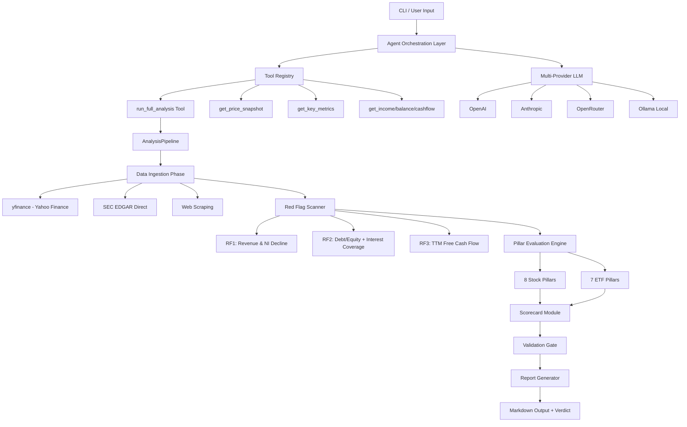

# nexus

## Overview

**NEXUS** — the central binding point between data and investment decision. A bulletproof, zero-cost automated investment analysis engine. It programmatically executes the Universal Investment Analysis Framework — a complete analytical lifecycle covering red flag detection, pillar evaluation, weighted scorecard computation, and output validation — using only free data sources.

Built with architectural patterns from [dexter](https://github.com/virattt/dexter) (multi-agent execution loops, micro-compaction, concurrent tool execution), nexus delivers institutional-grade stock and ETF analysis with no paid API keys, no paywalls, and full arithmetic transparency.

**No API keys required. No premium data subscriptions. 100% free data sources.**

## Architecture

nexus is organized as a decoupled, modular pipeline where each phase operates independently with clear input/output contracts:

```
┌─────────────────────────────────────────────────────────────────────┐
│                        NEXUS ANALYSIS PIPELINE                        │
└─────────────────────────────────────────────────────────────────────┘

┌──────────────┐    ┌──────────────────┐    ┌───────────────────────┐
│  DATA LAYER  │───▶│  RED FLAG SCAN   │───▶│   PILLAR EVALUATION   │
│              │    │                  │    │                       │
│  yfinance    │    │  RF1: Rev/NI     │    │  8 Stock Pillars      │
│  SEC EDGAR   │    │  RF2: D/E + ICR  │    │  7 ETF Pillars        │
│  Web Scrape  │    │  RF3: TTM FCF    │    │                       │
└──────────────┘    └──────────────────┘    └───────────┬───────────┘
                                                        │
                                                        ▼
┌──────────────┐    ┌──────────────────┐    ┌───────────────────────┐
│   REPORT     │◀───│   VALIDATION     │◀───│      SCORECARD         │
│              │    │      GATE        │    │                       │
│  Markdown    │    │                  │    │  Weighted computation  │
│  Tables      │    │  100% coverage   │    │  Math tracking        │
│  Verdict     │    │  Consistency     │    │  BUY/WATCH/AVOID      │
└──────────────┘    └──────────────────┘    └───────────────────────┘
```

### Platform Topology



### Module Directory Structure

```
src/nexus/
├── __init__.py              # Package metadata
├── __main__.py              # Entry point
├── cli.py                   # Rich terminal interface (Click + Rich)
├── agent.py                 # Agent core — iterative tool-calling loop
├── llm.py                   # Multi-provider LLM abstraction
├── data_sources.py          # Free data layer (yfinance, SEC, web)
├── cache.py                 # TTL file-based cache
├── formatters.py            # Number formatting utilities
│
├── engine/                  # ★ Core Analysis Engine (NEW)
│   ├── __init__.py
│   ├── red_flag_scanner.py  # Automated 3-flag risk detection
│   ├── pillar_evaluator.py  # 8 Stock + 7 ETF pillar evaluation
│   ├── scorecard.py         # Weighted scoring tables + math tracking
│   └── validation_gate.py   # Pre-report output verification
│
├── orchestrator/            # ★ Multi-Agent Pipeline (NEW)
│   ├── __init__.py
│   └── execution_loop.py    # Complete 6-phase analysis pipeline
│
└── tools/
    ├── __init__.py           # Tool registry with run_full_analysis
    └── formatting.py         # Display formatting utilities

tests/
└── test_engine.py            # Comprehensive test suite (29 tests)
```

## Core Components

### 1. Free Financial Data Layer

All data comes from zero-cost sources — no premium or paywalled API integrations:

| Source | Data | Method |
|--------|------|--------|
| **Yahoo Finance** (yfinance) | Prices, financials, ratios, earnings, news, insider trades, analyst targets | Python library |
| **SEC EDGAR** | 10-K, 10-Q, 8-K filings, CIK lookup | Direct HTTP |
| **Web Scraping** | Supplementary data (FinanceCharts, Macrotrends) | httpx + BeautifulSoup |

Data is cached with TTL-based file storage to minimize API calls.

### 2. Automated Red Flag Scanner

Three sequential checks run on every stock analysis:

| Flag | Description | Threshold | Deduction |
|------|-------------|-----------|-----------|
| **RF1** | Revenue & Net Income Decline | Both declining in 2+ of last 3 QoQ comparisons | — |
| **RF2** | Balance Sheet Stress | D/E > 2.0 **AND** ICR < 1.5 simultaneously | — |
| **RF3** | Negative Free Cash Flow | TTM FCF (OCF − CapEx) < 0 | — |

**Scorecard deductions:**
- 0 flags: No deduction
- 1 flag: −0.5 from final score
- 2 flags: −1.0 from final score
- 3 flags: **Automatic AVOID** — overrides all pillar scores

### 3. Pillar Evaluation Engine

#### 8 Stock Pillars

| # | Pillar | Weight | Key Metrics |
|---|--------|--------|-------------|
| 1 | Business Quality | 15% | Gross margin, operating margin, ROE, revenue consistency |
| 2 | Management | 15% | Insider ownership, institutional conviction, capital allocation |
| 3 | Financial Strength | 15% | D/E, current ratio, FCF reconciliation (manual OCF−CapEx verification) |
| 4 | Valuation | 15% | P/E, PEG, P/B, analyst target upside |
| 5 | Circle of Competence | 10% | Sector clarity, business model simplicity |
| 6 | Long-Term Outlook | 10% | Revenue/earnings growth, multi-year trend |
| 7 | Risk Assessment | 10% | Beta, drawdown from 52w high, market cap size |
| 8 | Temperament Test | 10% | 5-question behavioral assessment via objective proxies |

#### 7 ETF Pillars

| # | Pillar | Weight | Key Metrics |
|---|--------|--------|-------------|
| 1 | Expense Ratio | 20% | Annual expense ratio vs category |
| 2 | Tracking Error | 15% | Beta deviation from benchmark |
| 3 | Liquidity | 15% | AUM, average volume |
| 4 | Holdings Quality | 15% | Diversification, top-10 concentration |
| 5 | Tax Efficiency | 15% | Category-based turnover assessment |
| 6 | Methodology | 10% | Index construction transparency |
| 7 | Fit Assessment | 10% | AUM stability, category alignment |

### 4. Scorecard & Arithmetic Module

Every pillar score has a **math tracking string** that documents the exact computation path:

```
PILLAR_SCORE = SUM(P1=0.675, P2=0.600, P3=0.525, ...) = 3.450 / 5.000 = 69.00%
RED_FLAG_DEDUCTION: 0 flag(s) → +0.0 points
FINAL_SCORE = 69.00% + (0.0 * 10) = 69.00%
VERDICT: WATCH | RATING: ★★★ | SCORE: 69.00%
```

**Verdict thresholds:**
- **BUY:** ≥ 70% **and** 0 red flags
- **WATCH:** 50–69% **or** 1 red flag (BUY score + 1 flag → WATCH)
- **AVOID:** < 50% **or** 2+ red flags **or** 3-flag override

### 5. Validation Gate

Before any report is generated, the validation gate auto-verifies:
- All pillars present with valid scores (1.0–5.0)
- All 3 red flags checked with valid status
- Weighted score arithmetic is internally consistent
- Scorecard math tracking strings present
- No null/None values in critical paths
- 100% completion required for PASS

### 6. Multi-Agent Execution Loop

Inspired by dexter's agent.ts architecture:
- **6-phase pipeline:** Data Ingestion → Red Flag Scan → Pillar Evaluation → Scorecard → Validation → Report
- **Concurrent data fetching:** All independent data calls fire in parallel via asyncio
- **Micro-compaction support:** Context management for long-running agent sessions
- **Multi-provider LLM:** OpenAI, Anthropic, OpenRouter, Ollama (local)
- **Typed event system:** Real-time progress events for CLI streaming

## Prerequisites

- Python 3.11+
- `uv` package manager (recommended) or `pip`
- LLM API key for the agent layer (at least one of):
  - `OPENAI_API_KEY`
  - `ANTHROPIC_API_KEY`
  - `OPENROUTER_API_KEY`
  - Or use local Ollama (no key needed)

## Installation

```bash
git clone https://github.com/uditrpanchal/nexus.git
cd nexus
chmod +x setup.sh && ./setup.sh
# Or manually:
uv sync
```

## Usage

### Command Line

```bash
# Interactive mode
uv run nexus

# Direct analysis
uv run nexus "Analyze AAPL"

# ETF analysis
uv run nexus "Analyze VOO"

# With specific model/provider
uv run nexus --model openrouter/anthropic/claude-sonnet-4 --provider openrouter "Analyze MSFT"
```

### Programmatic API

```python
import asyncio
from nexus.orchestrator.execution_loop import AnalysisPipeline

async def analyze(ticker):
    pipeline = AnalysisPipeline()
    ctx = await pipeline.run(ticker, "stock")
    report = pipeline.generate_report()
    print(report)
    print(pipeline.generate_summary())

asyncio.run(analyze("AAPL"))
```

## Configuration

```bash
# Required: at least one LLM API key
export OPENAI_API_KEY=sk-...
export ANTHROPIC_API_KEY=sk-ant-...
export OPENROUTER_API_KEY=sk-or-...
# Or use local Ollama
export NEXUS_PROVIDER=ollama
export NEXUS_MODEL=llama3.1

# Optional
export NEXUS_MAX_ITERATIONS=20
```

## Running Tests

```bash
uv run python -m pytest tests/ -v

# With coverage (if installed)
uv run python -m pytest tests/ -v --cov=nexus.engine --cov=nexus.orchestrator
```

## Design Philosophy

1. **Zero-cost data:** No premium API keys. yfinance + SEC EDGAR + web scraping.
2. **Deterministic engine:** The analysis pipeline is fully programmatic — no LLM calls in the engine layer. The LLM agent sits above for user interaction.
3. **Math transparency:** Every score computation has a verifiable arithmetic tracking string.
4. **Gate before output:** The validation gate must pass at 100% before any report is generated.
5. **Dexter-inspired architecture:** Concurrent tool execution, micro-compaction, scratchpad tracking, multi-provider LLM support.
6. **Decoupled modules:** Each phase (data, flags, pillars, scorecard, validation) operates independently with clear contracts.

## License

MIT

---

*nexus is not financial advice. All data comes from free public sources. Always do your own research before making investment decisions.*
